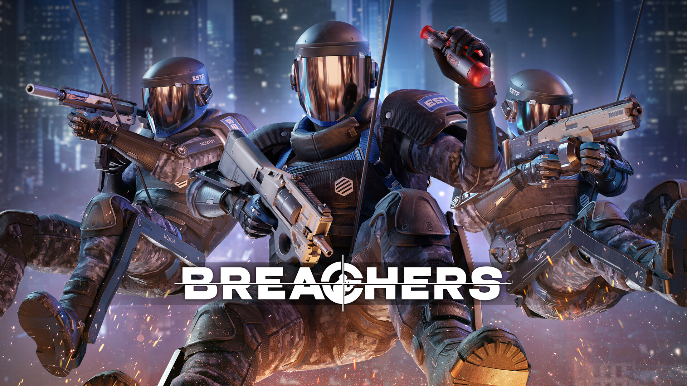
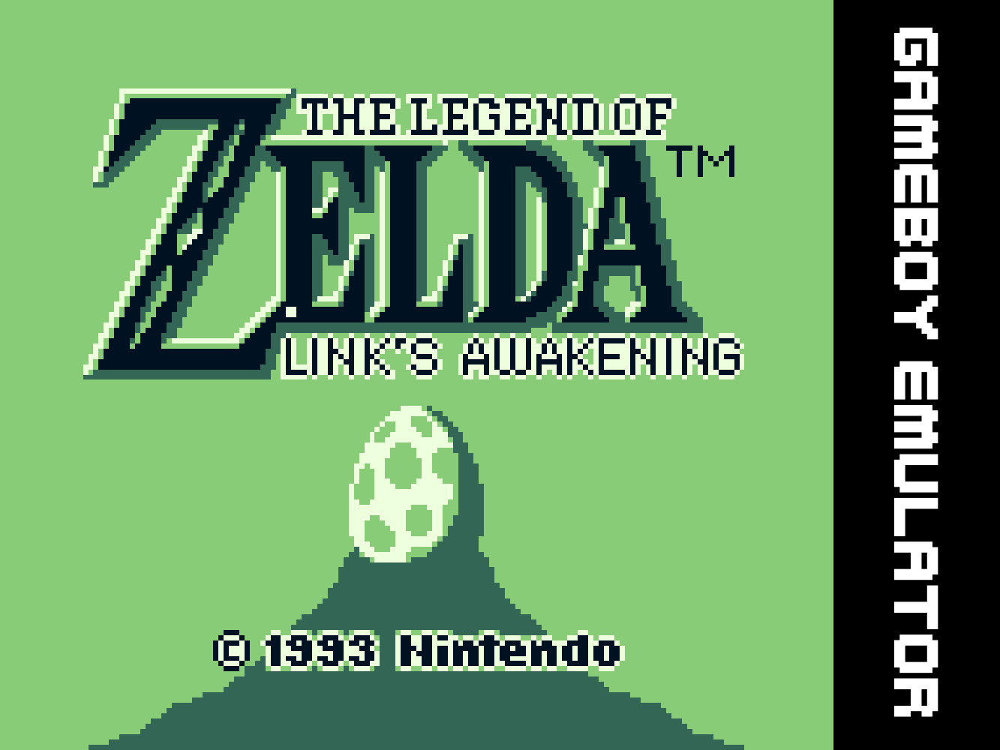
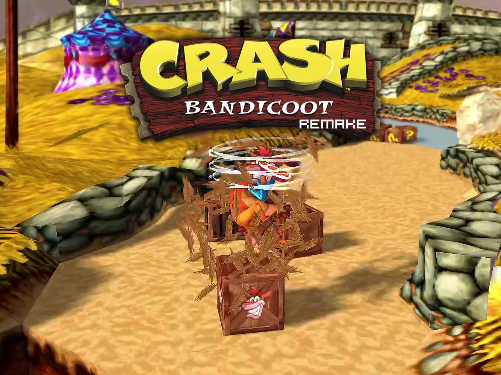
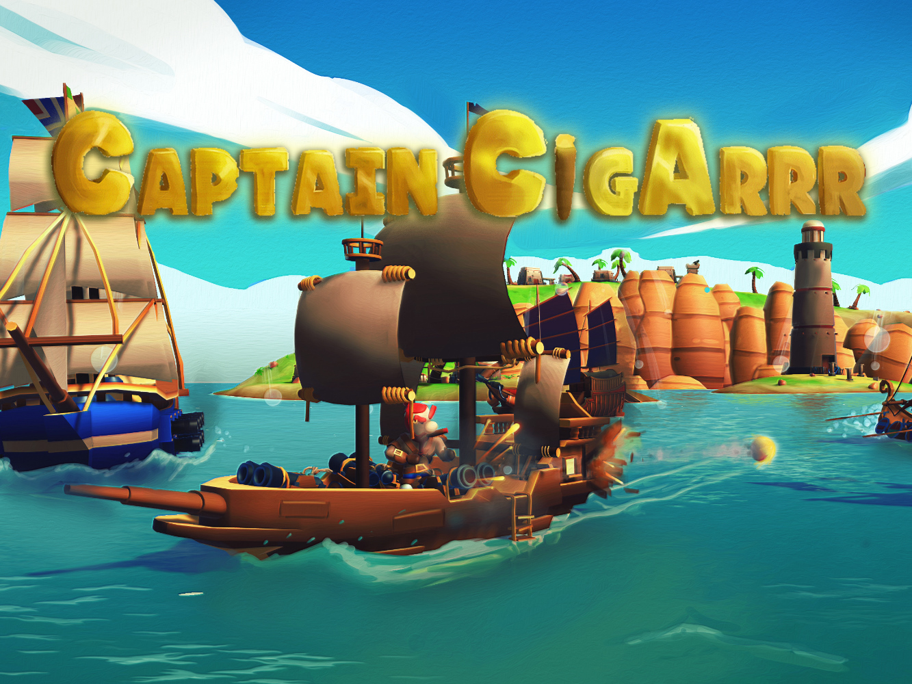
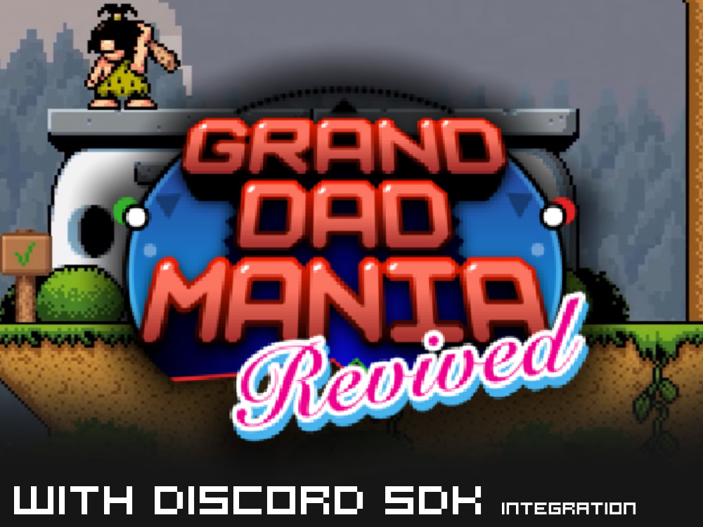
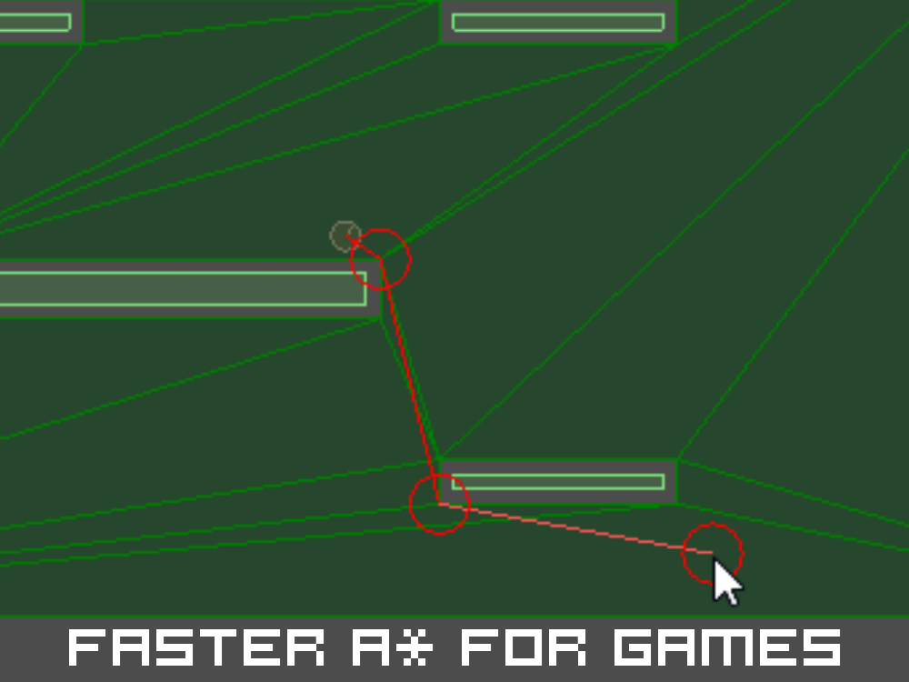
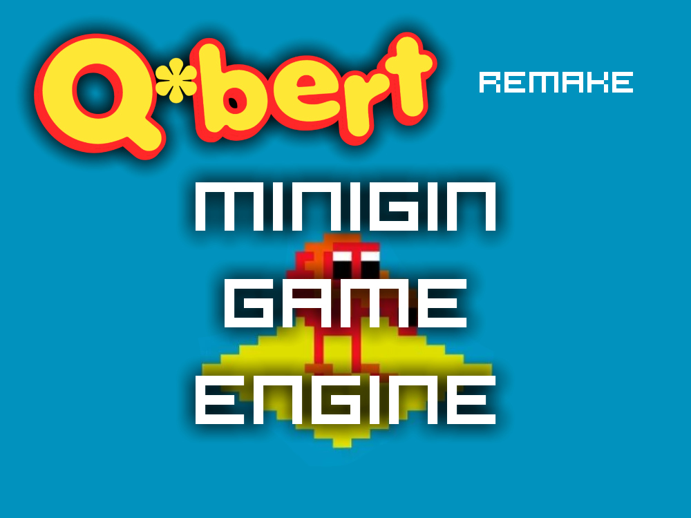
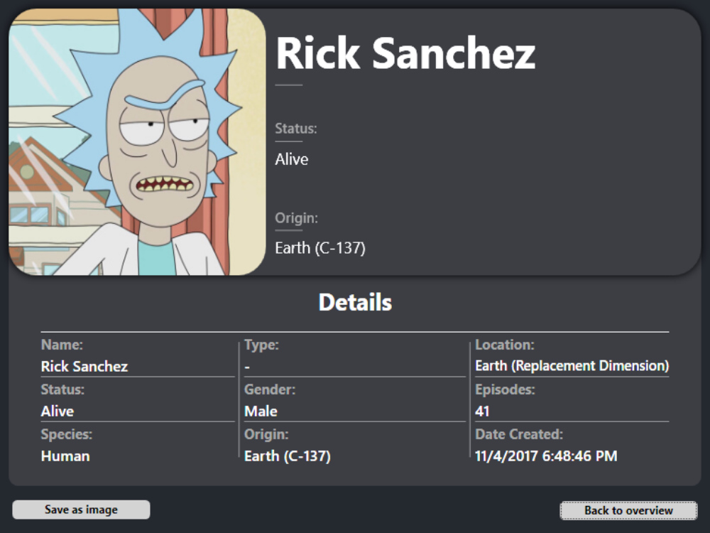

# Isaac Sauer

**Game Developer & Music Producer**  
Belgium · Triangle Factory · Forefront VR

[www.zacsvae.com](https://www.zacsvae.com)

Born in 2000. My passion is Game Development, Game Design, Sound Design and Music Production. Currently building Forefront VR at Triangle Factory — one of the most popular VR shooters on Meta Quest. Graduate of Digital Arts & Entertainment at Howest.

## Contents

- [Skills](#skills)
- [Experience](#experience)
- [Education](#education)
- [Projects](#projects)
- [3D & Environment Gallery](#3d--environment-gallery)
- [Music](#music)
- [Contact](#contact)
- [Local media and downloads](#local-media-and-downloads)

## Skills

| Category | Technologies |
| --- | --- |
| Languages | C#, C++, Python, JavaScript, Java |
| Engines | Unity, Unreal Engine, DirectX 11 |
| Platforms | Meta Quest, SteamVR, PC |
| Audio | Wwise, FMOD, FL Studio |
| Tools | Git, Visual Studio, Rider |

## Experience

### Triangle Factory

**Game Programmer · Breachers VR**  
2022 — present

One of the most popular shooters on Meta Quest (2023).

- Audio integration — Wwise, SFX systems, ambient audio
- Gameplay mechanics & bug fixing
- Server performance & stability
- VR interaction systems

**Stack:** C# · Unity · Wwise · Meta XR SDK · SteamVR SDK · Meta Quest 2/3 · PSVR2

## Education

### Howest — Digital Arts & Entertainment

Game Development · Kortrijk, Belgium · Graduated 2022

## Projects

### Breachers VR

**Triangle Factory · 2022–now**  
**C# · Unity · Wwise · VR · Meta Quest · SteamVR**

One of the most popular VR shooters on Meta Quest (2023). Contributed to audio systems, gameplay mechanics, and server stability using Unity & Wwise.

I'm incredibly thankful for the opportunity to contribute to the production of *Breachers* as a game programmer at Triangle Factory. It was a challenging but deeply rewarding experience, collaborating with an amazing team to push the limits of what mobile VR hardware could achieve. Seeing *Breachers* become one of the most popular shooters on the Meta Quest in 2023 was a proud moment for all of us.

I've mainly been focusing on **audio features** and fixing bugs in **game development**, with a lot of attention to **sound design**, making sure the audio works well, and solving any in-game audio issues. I've also worked on improving **gameplay mechanics** and addressing **server problems** to make sure the game runs smoothly for both players and servers. With plenty of experience in **Wwise** and **Unity**, I've been able to integrate complex **audio systems** and add high-quality **sound effects** that really elevate the game experience.

#### Key areas

**Audio Implementation**

Added and fine-tuned various sound effects — explosions, gunshots, player actions, and special sounds (syringes and defusers). Used Wwise and Unity to integrate and manage complex audio systems.

**Bug Fixes**

Fixed various audio bugs including wrong sounds, audio delays, and null references. Worked on sound trigger issues and syncing audio properly using Wwise.

**Gameplay Features**

Worked on sound mechanics tied to gameplay — tracking rewards in competitive modes and adding immersion with sounds for door blockers and drones.

**Multiplayer & Server**

Fixed issues with matchmaking, rejoining, server crashes, and overall server stability to enhance the multiplayer experience. Ensured audio runs smoothly during online matches.

**UI/UX**

Improved UI-related audio — button clicks, progression sounds, and match-found notifications — keeping gameplay flow smooth.

- [Trailer](https://www.youtube.com/watch?v=A1ksWrOgdFI)
- [Meta Store](https://www.meta.com/en-gb/experiences/breachers/4900985259994498/)

<iframe width="560" height="315" src="https://www.youtube.com/embed/A1ksWrOgdFI" title="Breachers VR trailer" allowfullscreen></iframe>

---

### Game Boy Emulator

**DAE — Gradwork · 2023**  
**C++ · Emulation · Low-level · MBC · CPU**

Cycle-accurate DMG emulator in C++. Implemented MBC1/MBC5, full opcode set, and custom sprite renderer. Runs Zelda: Link's Awakening and Kirby's Dream Land.

The initial project was limited to playing Tetris, so significant work was needed to enable support for additional games. By utilizing an opcode tester, opcodes could be evaluated quickly and efficiently to ensure they functioned correctly. This streamlined the process of implementing missing or malfunctioning opcodes. Test ROMs were also used to validate the opcodes in a realistic setting, leading to functional opcode support, except for the timer implementation.

To accommodate a wider range of games, a memory bank controller (MBC) was added, enabling support for not only ROM-only games but also those requiring an MBC chip. Implementations for MBC1 and MBC5 were included, paving the way for emulating more complex games like The Legend of Zelda: Link's Awakening and Hoshi no Kirby.

Additionally, a new sprite rendering system was introduced, allowing broader game compatibility. This change slightly reduced performance, though future optimizations could address this.

- [Demo](https://www.youtube.com/watch?v=2bc5L7RZ1i8)
- [Zelda: Link's Awakening demo](https://www.youtube.com/watch?v=HsLH8Jg_2xU)
- [Kirby's Dream Land demo](https://www.youtube.com/watch?v=OWSOsolaPH0)
- [Repository](https://github.com/IsaacSauer/GameboyEmulator)
- [Download](files/GW_2122_Isaac_Sauer_NL_Executable.zip)

<iframe width="560" height="315" src="https://www.youtube.com/embed/2bc5L7RZ1i8" title="Game Boy Emulator demo" allowfullscreen></iframe>
<iframe width="560" height="315" src="https://www.youtube.com/embed/HsLH8Jg_2xU" title="Zelda: Link's Awakening demo" allowfullscreen></iframe>
<iframe width="560" height="315" src="https://www.youtube.com/embed/OWSOsolaPH0" title="Kirby's Dream Land demo" allowfullscreen></iframe>

Local videos: [Tetris](vids/prog/gb-tetris.mp4) · [Zelda](vids/prog/gb-zelda.mp4) · [Zelda Color](vids/prog/gb-zelda-color.mp4)

---

### Crash Bandicoot

**DAE — DirectX 11 · 2022**  
**C++ · DirectX 11 · Rendering · HLSL**

Recreation of a Crash Bandicoot level using a custom DirectX 11 renderer. Built from scratch with a scene graph, component system, and collision detection.

This was the final assignment for the "Graphics Programming 2" course in my second year at Digital Arts & Entertainment. We were given a basic game engine, and the task was to add the required graphics and gameplay features for a chosen game.

#### Key features implemented

- Shadow Mapping
- Sprite Rendering
- Text Rendering
- SkyBox
- Post Processing
- Particles
- Skinned Model Animations
- Character Controller
- FMOD Sound System
- Rig Rail Camera System
- State Pattern
- Invoker System
- ... and more!

- [Demo](https://www.youtube.com/watch?v=Wh_rlE3rpng)
- [Walkthrough](https://www.youtube.com/watch?v=5h1pKG7gvOY)
- [Repository](https://github.com/IsaacSauer/CrashBandicootGame-Overlord)
- [Download](files/crash_game.zip)

<iframe width="560" height="315" src="https://www.youtube.com/embed/Wh_rlE3rpng" title="Crash Bandicoot demo" allowfullscreen></iframe>
<iframe width="560" height="315" src="https://www.youtube.com/embed/5h1pKG7gvOY" title="Crash Bandicoot walkthrough" allowfullscreen></iframe>

Local videos: [Game Trailer](vids/prog/GameTrailer.mp4) · [Game Walkthrough](vids/prog/GameWalkthrough.mp4)

---

### Captain CigArrr

**DAE — Group Project · 2022**  
**Team · Unity · C#**

Pirate-themed game made as a team project. Worked on core gameplay systems, enemy AI, and audio integration in Unity.

Captain CigARRR is a game made by me and other students for the "Game Projects" course in the second year at Digital Arts & Entertainment. We had 11 weeks to bring the idea to life, from brainstorming to the final polish.

#### The game

You control a small ship in a cluster of islands, trying to survive waves of enemies. Collect resources and abilities to upgrade your ship and take on even more challenges. The more you upgrade, the more infamous you become, and the more enemies will come after you! See how long you can survive this never-ending storm of chaos.

#### Made by

- Jonathan Steylaerts (Artist)
- Nathan Goffin (Artist)
- Jef Bernaers (Artist)
- Diedrik Droesbeke (Artist)
- Marnick Huysmans (Programmer)
- Isaac Sauer (Programmer)

#### Controls

Requires a controller. Left joystick to move. B to interact with the seapost. Y fires main cannons. X for side cannons and blunderbuss. A for a quick boost or roll. Shoulder buttons rotate the camera. Left Trigger activates your special ability. Right Trigger boosts the ship using the sails.

- [Trailer](https://www.youtube.com/watch?v=gVmt003c3iU)
- [itch.io](https://zacsvae.itch.io/captain-cigarrr)

<iframe width="560" height="315" src="https://www.youtube.com/embed/gVmt003c3iU" title="Captain CigArrr trailer" allowfullscreen></iframe>

---

### Grand Dad Mania

**DAE — Programming 2 · 2021**  
**SDL2 · C++**

Built for a "Programming 2" final project, Grand Dad Mania Revived is a retro pixel-art platformer where you control a club-wielding caveman navigating prehistoric stages and fighting enemies.

I created Grand Dad Mania as my final project for the "Programming 2" course. The assignment was to build a platformer game that met certain criteria in the grading rubric. Later on, I added the Discord SDK to try out the Discord RPC feature.

#### The game

Grand Dad Mania is based on a canceled SiIvaGunner game, which was basically a parody of Sonic Mania. It was originally featured as a high-quality rip in the "Trailer Theme (In-Game Mix) - Sonic Mania" video.

- [Trailer](https://www.youtube.com/watch?v=DRwC__L0VYQ)
- [Download](files/Sauer_Isaac_GrandDadMania_Final_Release_Discord_API.zip)

<iframe width="560" height="315" src="https://www.youtube.com/embed/DRwC__L0VYQ" title="Grand Dad Mania trailer" allowfullscreen></iframe>

---

### Faster A\* Algorithm

**DAE — Gameplay Programming · 2022**  
**Pathfinding · Algorithms · Optimization**

Optimised A* pathfinding with hierarchical graph decomposition. Significant performance gains over naive implementations on large grids.

#### Introduction

The technique used is called Goal Bounding — an optimization for pathfinding algorithms that can be applied to any static search graph. Based on a paper by **Steve Rabin** and **Nathan R. Sturtevant**, it prunes large chunks of the search space using precomputed bounding boxes, making the runtime algorithm significantly faster.

#### Main goal

At runtime, bounding boxes precomputed for each node connection are used to prune areas that couldn't possibly lead to the goal. Computation time scales with graph size, but it happens before runtime. The graph must be static — changes would require recomputing all boxes. For large NavMeshes, precomputations happen before release and data is saved to a binary file loaded into RAM at initialization.

#### Implementation

An enhanced Dijkstra method floods the whole graph (no goal node) and stores, for each node, the optimal starting connection. The connection ID is passed to children each time a new record is pushed to the open list. This gives us the bounding box for each connection of each node.

At runtime, before exploring a connection, we check whether the goal position falls within that connection's bounding box. If it doesn't, we skip it. Dynamic start and goal nodes (added at runtime) are exempt from the check via a simple guard.

#### Conclusion

Goal Bounding can meaningfully speed up pathfinding when applied to static graphs with the right data structure. It provided a broader perspective on just how much room there is for optimization in the pathfinding space.

- [Repository](https://github.com/IsaacSauer/faster-a-star-for-games)
- [Download](files/gameplay_prog_astar.zip)

---

### Minigin — Game Engine

**DAE — Programming 4 · 2022**  
**C++ · Engine · ECS · SDL2 · Architecture**

Custom game engine with ECS architecture, scene graph, event system, audio manager, and SDL2 renderer.

For the "Programming 4" course in my second year at DAE Howest, I built a game engine from scratch and used it to create Qbert.

#### Design patterns & choices

**Command Pattern**

The Input System uses commands to trigger events. Override "Command" and "Execute", or use "CommandFunc" with a function pointer (with bound parameters if needed).

**Flyweight Pattern**

Resources like textures are stored in a map keyed by file path, ensuring each is loaded only once. Requesting an already-loaded Texture2D returns the cached instance.

**Observer Pattern**

Create an Observer class with event methods and connect it to a Subject. Call "notify" on the subject with the observer's function pointer — supports bound parameters.

**Singleton**

Two variants: static stack allocation for simple cases, static smart pointer for heap allocation. Prevents manual instance management.

**State Machine**

Object-oriented state machine. Create a class inheriting from "State" and implement Enter, Exit, HandleInput, Update, and FixedUpdate. Call these from component update methods.

**Game Loop**

Uses the "Play Catch Up" pattern for both physics (Fixed Update) and regular frame updates (Update).

**Component System**

Each GameObject can have modular components. The parent manages the lifecycle: Initialize, LateInitialize, Start (called on each activation), Update, FixedUpdate.

**Event Queue (Sound)**

Audio runs on a separate thread. Sound requests create tasks added to a queue; the audio thread processes them as they arrive.

**Service Locator**

Used for sound system management. SDL is the current backend, but swapping it requires no changes to code that consumes the sound system.

**Dirty Flag**

Each GameObject stores only its local transform. A cached world transform is kept and only recalculated when the Dirty Flag is set — avoiding redundant hierarchy traversals.

- [Demo](https://www.youtube.com/watch?v=qDLBfyyX3-E)
- [Repository](https://github.com/IsaacSauer/2DAE08_Minigin_Engine_Isaac_Sauer)
- [Download](files/qbert_game.zip)

<iframe width="560" height="315" src="https://www.youtube.com/embed/qDLBfyyX3-E" title="Minigin Qbert demo" allowfullscreen></iframe>

---

### Rick & Morty Characters

**DAE — Tool Development · 2021**  
**REST API · C# · XAML · MVVM · .NET**

Desktop tool fetching Rick & Morty API data, displaying characters with filters. Built with C#/.NET with a clean MVVM architecture.

For the "Tool Development" course in my 2nd year at DAE Howest, I built a desktop tool using C#/.NET that retrieves and displays character data from the Rick and Morty API with filtering and sorting options.

#### Overview page features

**Data Source**

Switch between Online and Offline data via the "Data Source" dropdown — useful when not connected to the internet to still preview characters.

**Sorting & Filtering**

Show or hide dead/alive characters and sort by various criteria. Characters with unknown status are hidden in both dead and alive filters.

**Page Navigation**

Navigate between pages. The max page count updates automatically according to your current viewing options.

**Search Bar**

Search for specific characters by name. Reset results by submitting an empty search query.

#### Detail page

Select a character and press "Show Details" to open a detail page. From there you can navigate back to the overview or save the current page as an image — stored in a "saves" folder next to the executable.

- [Download](files/tooldev_rick_and_morty_tool.zip)

Screenshots: [1](images/rm/1.png) · [2](images/rm/2.png) · [3](images/rm/3.png) · [4](images/rm/4.png) · [5](images/rm/5.png) · [6](images/rm/6.png) · [7](images/rm/7.png) · [8](images/rm/8.png) · [9](images/rm/9.png) · [10](images/rm/10.png)

## 3D & Environment Gallery

### Sentry Gun — High Poly module, DAE year 2

<iframe loading="lazy" width="100%" height="480" src="https://sketchfab.com/models/41959b57f8454cbfb4b22ad951edf9e9/embed?preload=1&ui_controls=1&ui_infos=1&ui_watermark=1" mozallowfullscreen webkitallowfullscreen allowfullscreen></iframe>

### Sci-Fi Subway Station — Environments 1, DAE year 2

<iframe loading="lazy" width="100%" height="480" src="https://www.youtube.com/embed/0ISOjfu5o2A" allow="accelerometer; autoplay; clipboard-write; encrypted-media; gyroscope; picture-in-picture" allowfullscreen></iframe>

[Watch on YouTube](https://www.youtube.com/watch?v=0ISOjfu5o2A)

### Kyoto City Scene — 3D Low Poly, DAE year 1

<iframe loading="lazy" width="100%" height="480" src="https://sketchfab.com/models/0fd4b2be2ac14406bdb7b0d0d45050df/embed?preload=1&ui_controls=1&ui_infos=1&ui_watermark=1" mozallowfullscreen webkitallowfullscreen allowfullscreen></iframe>

### 3D Model — DAE 04

<iframe loading="lazy" width="100%" height="480" src="https://sketchfab.com/models/415f71f0c2be49979eb36b255826a810/embed?preload=1&ui_controls=1&ui_infos=1&ui_watermark=1" mozallowfullscreen webkitallowfullscreen allowfullscreen></iframe>

### 3D Model — DAE 05

<iframe loading="lazy" width="100%" height="480" src="https://sketchfab.com/models/f9f622f4a80c40ac9ddfec572ad4142e/embed?preload=1&ui_controls=1&ui_infos=1&ui_watermark=1" mozallowfullscreen webkitallowfullscreen allowfullscreen></iframe>

### 3D Model — DAE 06

<iframe loading="lazy" width="100%" height="480" src="https://sketchfab.com/models/46fab129a650486b84abbb2ec2665503/embed?preload=1&ui_controls=1&ui_infos=1&ui_watermark=1" mozallowfullscreen webkitallowfullscreen allowfullscreen></iframe>

### 3D Model — DAE 07

<iframe loading="lazy" width="100%" height="480" src="https://sketchfab.com/models/f4b052c3cbaa4d21ba35652b556cc982/embed?preload=1&ui_controls=1&ui_infos=1&ui_watermark=1" mozallowfullscreen webkitallowfullscreen allowfullscreen></iframe>

### 3D Model — DAE 08

<iframe loading="lazy" width="100%" height="480" src="https://sketchfab.com/models/94326636ad9a48c092987bc07f802830/embed?preload=1&ui_controls=1&ui_infos=1&ui_watermark=1" mozallowfullscreen webkitallowfullscreen allowfullscreen></iframe>

### 3D Model — DAE 09

<iframe loading="lazy" width="100%" height="480" src="https://sketchfab.com/models/d55eca37a92a4e8298044c07434bac3d/embed?preload=1&ui_controls=1&ui_infos=1&ui_watermark=1" mozallowfullscreen webkitallowfullscreen allowfullscreen></iframe>

### 3D Model — DAE 10

<iframe loading="lazy" width="100%" height="480" src="https://sketchfab.com/models/f063b8f5883a4d309b0cf3c13ea5df4d/embed?preload=1&ui_controls=1&ui_infos=1&ui_watermark=1" mozallowfullscreen webkitallowfullscreen allowfullscreen></iframe>

### 3D Model — DAE 11

<iframe loading="lazy" width="100%" height="480" src="https://sketchfab.com/models/df1c3b922fae447c8290904c0432b171/embed?preload=1&ui_controls=1&ui_infos=1&ui_watermark=1" mozallowfullscreen webkitallowfullscreen allowfullscreen></iframe>

## Music

### Albums

<iframe allow="autoplay; clipboard-write; encrypted-media; fullscreen; picture-in-picture" allowfullscreen frameborder="0" height="352" loading="lazy" src="https://open.spotify.com/embed/album/3VZWYh7nKBPEAX6tyUvhmZ?utm_source=generator" width="100%"></iframe>

<iframe allow="autoplay; clipboard-write; encrypted-media; fullscreen; picture-in-picture" allowfullscreen frameborder="0" height="352" loading="lazy" src="https://open.spotify.com/embed/album/72kmViO8jTcPQzj19VNh3R?utm_source=generator" width="100%"></iframe>

### Singles

<iframe allow="autoplay; clipboard-write; encrypted-media; fullscreen; picture-in-picture" allowfullscreen frameborder="0" height="80" loading="lazy" src="https://open.spotify.com/embed/track/3ZVw2wf8YghnWysfJTy6ln?utm_source=generator" width="100%"></iframe>
<iframe allow="autoplay; clipboard-write; encrypted-media; fullscreen; picture-in-picture" allowfullscreen frameborder="0" height="80" loading="lazy" src="https://open.spotify.com/embed/track/6MMETOAQu8ycho87WtTlIS?utm_source=generator" width="100%"></iframe>
<iframe allow="autoplay; clipboard-write; encrypted-media; fullscreen; picture-in-picture" allowfullscreen frameborder="0" height="80" loading="lazy" src="https://open.spotify.com/embed/track/4yKFRgoTzR5NZ89WXCVEmU?utm_source=generator" width="100%"></iframe>
<iframe allow="autoplay; clipboard-write; encrypted-media; fullscreen; picture-in-picture" allowfullscreen frameborder="0" height="80" loading="lazy" src="https://open.spotify.com/embed/track/70R9ZN40gmC7qZjjN2D0hr?utm_source=generator" width="100%"></iframe>
<iframe allow="autoplay; clipboard-write; encrypted-media; fullscreen; picture-in-picture" allowfullscreen frameborder="0" height="80" loading="lazy" src="https://open.spotify.com/embed/track/624ZuW347NazlEhVQxNB7a?utm_source=generator" width="100%"></iframe>
<iframe allow="autoplay; clipboard-write; encrypted-media; fullscreen; picture-in-picture" allowfullscreen frameborder="0" height="80" loading="lazy" src="https://open.spotify.com/embed/track/5sMbx2r3d7DqcSAdYsBtZg?utm_source=generator" width="100%"></iframe>
<iframe allow="autoplay; clipboard-write; encrypted-media; fullscreen; picture-in-picture" allowfullscreen frameborder="0" height="80" loading="lazy" src="https://open.spotify.com/embed/track/5rSYnKfE8l091ARpd1pNat?utm_source=generator" width="100%"></iframe>
<iframe allow="autoplay; clipboard-write; encrypted-media; fullscreen; picture-in-picture" allowfullscreen frameborder="0" height="80" loading="lazy" src="https://open.spotify.com/embed/track/1v4JjJLVUjnrltLExqGgWF?utm_source=generator" width="100%"></iframe>
<iframe allow="autoplay; clipboard-write; encrypted-media; fullscreen; picture-in-picture" allowfullscreen frameborder="0" height="80" loading="lazy" src="https://open.spotify.com/embed/track/4yJOrE0fMjoKFmQX2D4C1S?utm_source=generator" width="100%"></iframe>
<iframe allow="autoplay; clipboard-write; encrypted-media; fullscreen; picture-in-picture" allowfullscreen frameborder="0" height="80" loading="lazy" src="https://open.spotify.com/embed/track/2PWsLKKQlCZt9RHDfoRx0Q?utm_source=generator" width="100%"></iframe>
<iframe allow="autoplay; clipboard-write; encrypted-media; fullscreen; picture-in-picture" allowfullscreen frameborder="0" height="80" loading="lazy" src="https://open.spotify.com/embed/track/72nmewtAeivaVreAHtEl0P?utm_source=generator" width="100%"></iframe>
<iframe allow="autoplay; clipboard-write; encrypted-media; fullscreen; picture-in-picture" allowfullscreen frameborder="0" height="80" loading="lazy" src="https://open.spotify.com/embed/track/76Qw9ASFu3dIeuJemebJqI?utm_source=generator" width="100%"></iframe>
<iframe allow="autoplay; clipboard-write; encrypted-media; fullscreen; picture-in-picture" allowfullscreen frameborder="0" height="80" loading="lazy" src="https://open.spotify.com/embed/track/2R3nRK9D4CSMD5X7fMQuL8?utm_source=generator" width="100%"></iframe>
<iframe allow="autoplay; clipboard-write; encrypted-media; fullscreen; picture-in-picture" allowfullscreen frameborder="0" height="80" loading="lazy" src="https://open.spotify.com/embed/track/6Wnp5xCGhlCIwyjYz2GxT7?utm_source=generator" width="100%"></iframe>
<iframe allow="autoplay; clipboard-write; encrypted-media; fullscreen; picture-in-picture" allowfullscreen frameborder="0" height="80" loading="lazy" src="https://open.spotify.com/embed/track/4DgIIMfOdxEk04WPBCkekQ?utm_source=generator" width="100%"></iframe>
<iframe allow="autoplay; clipboard-write; encrypted-media; fullscreen; picture-in-picture" allowfullscreen frameborder="0" height="80" loading="lazy" src="https://open.spotify.com/embed/track/62qlPe3gjZOumbJCupngpR?utm_source=generator" width="100%"></iframe>
<iframe allow="autoplay; clipboard-write; encrypted-media; fullscreen; picture-in-picture" allowfullscreen frameborder="0" height="80" loading="lazy" src="https://open.spotify.com/embed/track/4GPgfUSu82d0lj46YpsgC5?utm_source=generator" width="100%"></iframe>
<iframe allow="autoplay; clipboard-write; encrypted-media; fullscreen; picture-in-picture" allowfullscreen frameborder="0" height="80" loading="lazy" src="https://open.spotify.com/embed/track/70GMG3k628poEjD9H4iKWn?utm_source=generator" width="100%"></iframe>
<iframe allow="autoplay; clipboard-write; encrypted-media; fullscreen; picture-in-picture" allowfullscreen frameborder="0" height="80" loading="lazy" src="https://open.spotify.com/embed/track/5amy4nCIpoFccAcyDT8GeQ?utm_source=generator" width="100%"></iframe>
<iframe allow="autoplay; clipboard-write; encrypted-media; fullscreen; picture-in-picture" allowfullscreen frameborder="0" height="80" loading="lazy" src="https://open.spotify.com/embed/track/2B15OBnHXNAEdFVjH8xTKr?utm_source=generator" width="100%"></iframe>
<iframe allow="autoplay; clipboard-write; encrypted-media; fullscreen; picture-in-picture" allowfullscreen frameborder="0" height="80" loading="lazy" src="https://open.spotify.com/embed/track/6ElraMOg1KhgoiTRQ0YmZM?utm_source=generator" width="100%"></iframe>
<iframe allow="autoplay; clipboard-write; encrypted-media; fullscreen; picture-in-picture" allowfullscreen frameborder="0" height="80" loading="lazy" src="https://open.spotify.com/embed/track/6Mws1rpJpCjCIYexVT5FpN?utm_source=generator" width="100%"></iframe>
<iframe allow="autoplay; clipboard-write; encrypted-media; fullscreen; picture-in-picture" allowfullscreen frameborder="0" height="80" loading="lazy" src="https://open.spotify.com/embed/track/5cM6wUElXat09aHTtVLCvN?utm_source=generator" width="100%"></iframe>
<iframe allow="autoplay; clipboard-write; encrypted-media; fullscreen; picture-in-picture" allowfullscreen frameborder="0" height="80" loading="lazy" src="https://open.spotify.com/embed/track/4fAZa5Mi3vsQZpZEC67l5j?utm_source=generator" width="100%"></iframe>
<iframe allow="autoplay; clipboard-write; encrypted-media; fullscreen; picture-in-picture" allowfullscreen frameborder="0" height="80" loading="lazy" src="https://open.spotify.com/embed/track/5veto8MUBYoyULXJbgdEsA?utm_source=generator" width="100%"></iframe>
<iframe allow="autoplay; clipboard-write; encrypted-media; fullscreen; picture-in-picture" allowfullscreen frameborder="0" height="80" loading="lazy" src="https://open.spotify.com/embed/track/0Fc9O20o7wXgTckR4IKNRO?utm_source=generator" width="100%"></iframe>
<iframe allow="autoplay; clipboard-write; encrypted-media; fullscreen; picture-in-picture" allowfullscreen frameborder="0" height="80" loading="lazy" src="https://open.spotify.com/embed/track/7FroVd6FweZR90kTe2Y1Zl?utm_source=generator" width="100%"></iframe>

## Contact

Get in touch — I'll get back to you shortly.

- [GitHub](https://github.com/isaacsauer)
- [LinkedIn](https://www.linkedin.com/in/isaac-sauer/)
- [itch.io](https://zacsvae.itch.io/)

## Updating projects

The project archive and every project page use `data/projects.json` as their shared data source. Open `editor.html` through a local web server to add, edit, reorder or remove projects.

1. Start a local server from the repository root, for example with `python3 -m http.server`.
2. Open `/editor.html` in the browser.
3. Edit the project data and use **Save projects.json**.
4. Select `data/projects.json` in this repository when the browser asks where to save it.

If direct file saving is not supported by the browser, the editor exports a replacement `projects.json` file instead.

## Local media and downloads

All paths below are intentionally kept as repository-relative paths so they can be changed later.

### Downloads

- `files/GW_2122_Isaac_Sauer_NL_Executable.zip`
- `files/Sauer_Isaac_GrandDadMania_Final_Release_Discord_API.zip`
- `files/crash_game.zip`
- `files/gameplay_prog_astar.zip`
- `files/qbert_game.zip`
- `files/tooldev_rick_and_morty_tool.zip`

### Videos

- `vids/prog/GameTrailer.mp4`
- `vids/prog/GameWalkthrough.mp4`
- `vids/prog/gb-tetris.mp4`
- `vids/prog/gb-zelda-color.mp4`
- `vids/prog/gb-zelda.mp4`

### Main images

- `images/me.jpg`
- `images/breachers.jpg`
- `images/first.png`
- `images/prog/Startscreen_Title.png`
- `images/prog/Thumbnail.jpg`
- `images/prog/pic01.jpg` through `images/prog/pic12.jpg`
- `images/art/pic01.jpg` through `images/art/pic12.jpg`
- `images/music/pic01.jpg` through `images/music/pic12.jpg`
- `images/rm/1.png` through `images/rm/10.png`
